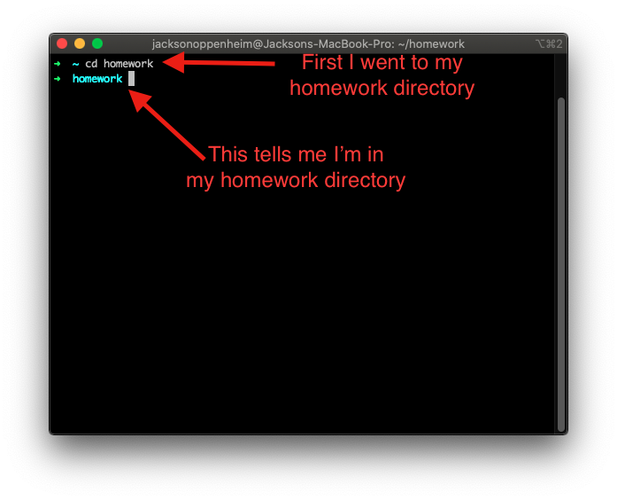
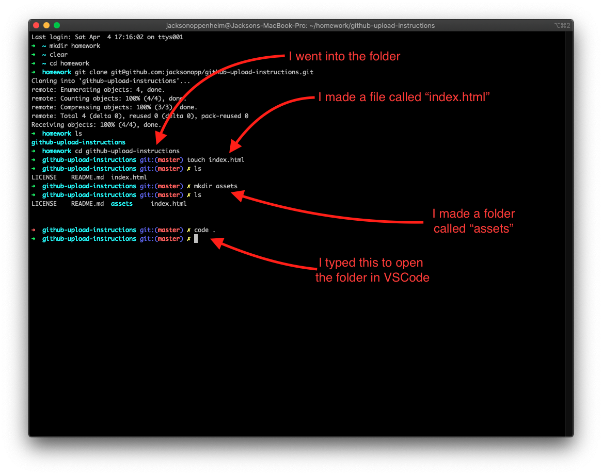
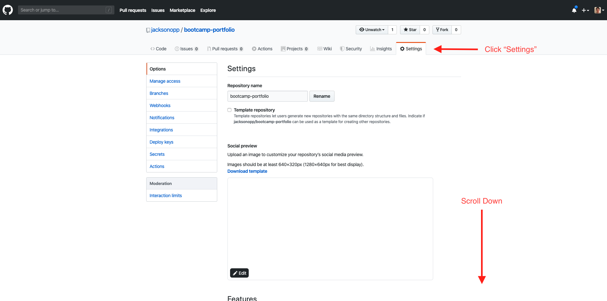

# How to work with Github

## Start in Github

1. Click the `New` button.
   

2. Give your repository a name and initialize with `README`. Click **Create Repository**

- Optional: If you're using node, add a Node `.gitignore`
- Optional: If you want, give your repository a `LICENSE`
  

3. Click the green **Clone or download** button, then click on the button to copy the text.
   

## Move to Terminal/GitBash

4. Navigate to _where_ you want to save your new repository. In this example, I want my homework in the `homework` directory, so I typed `cd homework`.
   

5. Clone your repository by typing `git clone` and then pasting the text you copied in step 3.
   

6. Go into your newly cloned repository by typing `cd` and the name of the directory. You are now insid your repository. You are now ready to start working inside this folder. If you were given files to start your homework, copy them into this folder now.

- To create a file, type `touch` and then the name of the file. Eg. `touch index.html`
- To create a folder, type `mkdir` and then the name of the folder. Eg. `mkdir assets`
- **MAC:** to open in Finder, type `open .` Note the period.
- **WINDOWS:** to open in File Explorer, type `explorer .` Note the period.
- _If you have the feature enabled_ you can type `code .` to open the current folder in VSCode.
  

## In VSCode

7. Make some changes in VSCode.

## When you're done coding

8. Get your code ready to be pushed up to github and push it

- Type `git status` to see what you were working on. It should be in red.
- Type `git add .` to make your code ready to be commited. Note the period after `add`.
- Type `git status` again to make sure your code was added. It should be in green this time.
- Type `git commit -m "description of changes"` to commit your changes. Write a short descriptive message of what you did to your code.
- Type `git pull` to bring in any changes that _might_ have happened if you are working with someone wlse.
- Type `git push` to push your new code into github

Repeat these steps whenever you are done coding any significant changes (eg. a new feature, a bug fix, etc.)

## All done coding? Go back to Github to deploy.

9. Make sure your `index.html` file is in the **ROOT** of your repository.

- If your `index.html` file is not in the root, **go to your computer** and move your `index.html` file is to the root. **\*BE SURE TO TEST AND MAKE SURE EVERYTHING IS WORKING!** Then follow step 8 to push your changes up to github again.
  

10. Click on settings and scroll down to to the `Github Pages` section. Click the button that says `source` and select `master branch`.
    
    

11. The page will reload. Scroll down to the `Github Pages` section and you will see a new link. **This link is your deployed website**! Click on it, and you will go to your website.
    
